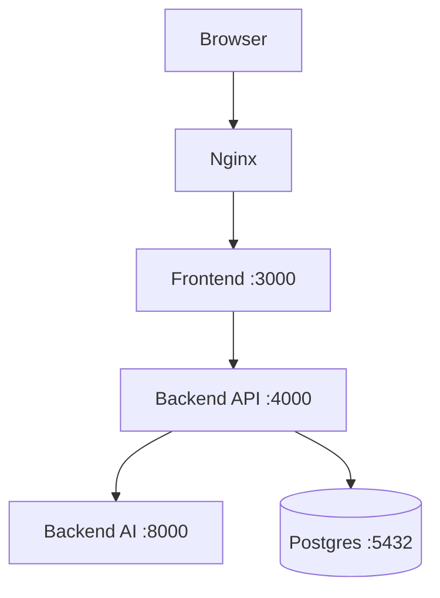
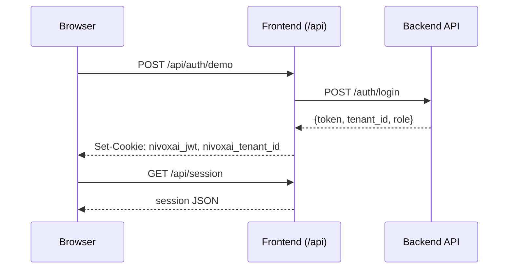
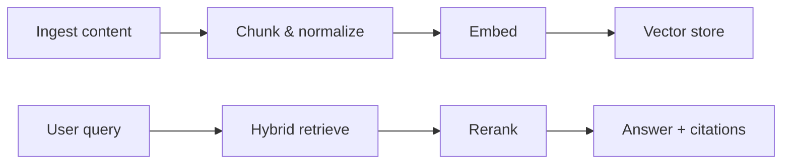
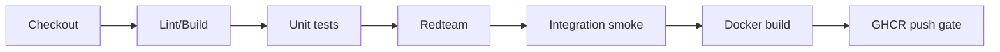

[](https://github.com/manikumarpokala/nivoxai/actions/workflows/ci.yml)

# NivoxAI

Production-style Influmatch demo: influencer ranking, agentic strategy, RAG, analytics, multi-tenant guardrails, and CI quality gates.

Deployed demo (placeholder): https://<your-demo-url>

## Quickstart (Local)

```bash
docker compose up -d --build
```

Open: http://localhost:3000/demo

### Demo session bootstrapping
- Demo login: `POST /api/auth/demo`
- Session check: `GET /api/session`
- Smoke script uses the same flow: `bash scripts/ci_smoke.sh`

## Quickstart (EC2)

1) Install Docker and Compose plugin
```bash
sudo apt-get update
sudo apt-get install -y docker.io docker-compose-plugin
sudo usermod -aG docker $USER
newgrp docker
```

2) Clone repo and run
```bash
git clone https://github.com/ManikumarPokala/nivoxai.git
cd nivoxai
docker compose up -d --build
```

3) Open (replace with EC2 public IP)
- Frontend: `http://<EC2_PUBLIC_IP>:3000/demo`

## Deploy to AWS (EC2) + Nginx Reverse Proxy

### Nginx reverse proxy (HTTP)
Install Nginx:
```bash
sudo apt-get install -y nginx
```

Create `/etc/nginx/sites-available/nivoxai`:
```nginx
server {
  listen 80;
  server_name example.com www.example.com;

  location / {
    proxy_pass http://127.0.0.1:3000;
    proxy_set_header Host $host;
    proxy_set_header X-Forwarded-Proto $scheme;
    proxy_set_header X-Forwarded-For $proxy_add_x_forwarded_for;
  }

  location /api/ {
    proxy_pass http://127.0.0.1:3000;
    proxy_set_header Host $host;
    proxy_set_header X-Forwarded-Proto $scheme;
    proxy_set_header X-Forwarded-For $proxy_add_x_forwarded_for;
  }
}
```

Enable and reload:
```bash
sudo ln -s /etc/nginx/sites-available/nivoxai /etc/nginx/sites-enabled/nivoxai
sudo nginx -t
sudo systemctl reload nginx
```

### HTTPS with Certbot
```bash
sudo apt-get install -y certbot python3-certbot-nginx
sudo certbot --nginx -d example.com -d www.example.com
```

## Custom Domain via Cloudflare + Nginx + Certbot

1) Cloudflare DNS (A records)
- `@` -> EC2 public IP
- `www` -> EC2 public IP
- Optional:
  - `api` -> EC2 public IP
  - `ai` -> EC2 public IP

2) Set SSL/TLS mode to Full (strict) after certs are installed.

3) Ensure Nginx `server_name` matches the domain and Certbot can validate.

## System Architecture

### High-level


### Demo login and session cookies


### RAG flow (simplified)


### CI pipeline


## Services and Ports

| Service | Purpose | Host Port | Health | Notes |
| --- | --- | --- | --- | --- |
| frontend | Next.js UI + proxy routes | 3000 | `/demo` | All browser calls go through `/api/*` |
| backend-api | Express gateway | 4000 | `/health`, `/api/healthz` | `/health` gated on DB readiness |
| backend-ai | FastAPI AI | 8000 | `/health`, `/healthz` | RAG + agent + recommend |
| postgres | Data | 5432 | `pg_isready` | Required for demo auth and data |

## Key Endpoints

| Capability | Method | Endpoint | Notes |
| --- | --- | --- | --- |
| Demo login | POST | `/api/auth/demo` | Sets cookies via frontend proxy |
| Session | GET | `/api/session` | Used by UI + smoke |
| Health (API) | GET | `http://localhost:4000/health` | DB-gated |
| Healthz (API) | GET | `http://localhost:4000/api/healthz` | Non-DB gate |
| Health (AI) | GET | `http://localhost:8000/health` | AI service |
| Healthz (AI) | GET | `http://localhost:8000/healthz` | AI service |
| Recommend | POST | `/api/recommendations` | Proxied to backend-ai |
| RAG | POST | `/api/rag` | Proxied to backend-ai |
| Strategy | POST | `/api/chat-strategy` | Proxied to backend-ai |
| Analytics summary | GET | `/api/analytics/summary` | Proxied to backend-api |

## Environment Variables

| Name | Where | Default | Description |
| --- | --- | --- | --- |
| POSTGRES_USER | compose | `postgres` | DB user (CI safe) |
| POSTGRES_PASSWORD | compose | `postgres` | DB password (CI safe) |
| POSTGRES_DB | compose | `nivoxai` | DB name |
| JWT_SECRET | backend-api/backend-ai | `dev-jwt-secret` | Demo JWT signing |
| DEMO_MODE | backend-api | `true` | Demo guards + rate limits |
| DEMO_ADMIN_KEY | backend-api | `DEMO_ONLY_READ_ACCESS_2025` | Required for admin actions |
| BACKEND_API_BASE_URL | frontend | `http://backend-api:4000` | Proxy target |
| BACKEND_AI_BASE_URL | frontend | `http://backend-ai:8000` | Proxy target |
| GHCR_PUSH | CI | `false` | Gate image push |

## CI (Demo-safe)

- Runs without secrets by default.
- Uses demo-safe defaults and smoke tests.
- GHCR push is skipped unless `GHCR_PUSH=true` is set.

Commands used by CI:
```bash
bash scripts/ci_smoke.sh
python3 eval/run_redteam.py
```

## Smoke Tests and Redteam

```bash
bash scripts/ci_smoke.sh
python3 eval/run_redteam.py
```

The smoke script:
- boots demo session (`/api/auth/demo`)
- checks session (`/api/session`)
- creates campaign if needed
- calls recommend, rag, and chat-strategy

## Operational Runbook

### Start / stop / restart
```bash
docker compose up -d --build
docker compose down
```

### Logs
```bash
docker compose logs -f backend-api backend-ai frontend
```

### Health checks
```bash
curl -s http://localhost:4000/health
curl -s http://localhost:4000/api/healthz
curl -s http://localhost:8000/health
curl -s http://localhost:8000/healthz
```

### Backup / restore Postgres volume
```bash
# Backup
pg_dump -h localhost -U postgres -d nivoxai > backup.sql

# Restore
psql -h localhost -U postgres -d nivoxai < backup.sql
```

## Troubleshooting

| Symptom | Likely cause | Fix |
| --- | --- | --- |
| `docker compose` not found on EC2 | Compose plugin missing | `sudo apt-get install -y docker-compose-plugin` |
| Postgres restarts | Missing `POSTGRES_PASSWORD` | Set env or use compose defaults |
| `GET /health` returns 503 | DB init not ready | Use `/api/healthz` for readiness |
| Certbot fails | `server_name` missing | Add server_name and reload nginx |
| Cloudflare DNS not resolving | A records missing | Add A records for `@` and `www` |
| Nginx shows default page | Site not enabled | Link site in `sites-enabled` and reload |
| 405 on AI health | HEAD request sent | Use GET `/health` |

## Security & Safety Guardrails

- Tenant isolation enforced by JWT claims (`tenant_id`).
- Demo mode enforces rate limits and payload caps.
- Admin actions require `x-demo-admin-key`.
- Redteam harness validates injection and abuse scenarios.

## What to look at

- Agentic flow: `backend-ai/app/agents/runner.py`
- RAG pipeline: `backend-ai/app/services/rag.py`
- Recommendation scoring: `backend-ai/app/services/recommender.py`
- Multi-tenancy: `docs/SECURITY_MULTI_TENANCY.md`
- Safety: `docs/SAFETY.md`
- CI pipeline: `.github/workflows/ci.yml`
- Smoke tests: `scripts/ci_smoke.sh`

Author: Manikumar Pokala  
Contact: manikumarp183@gmail.com
